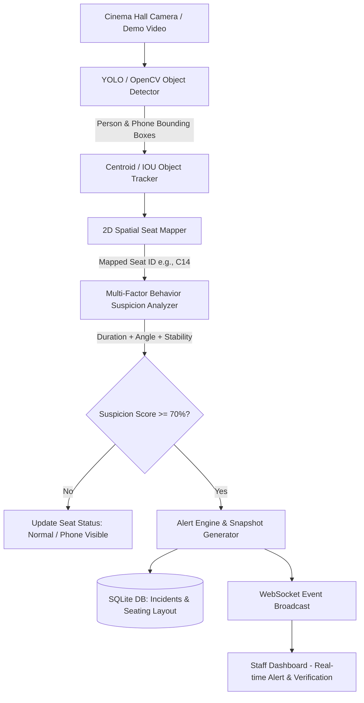

# AI-Based Cinema Theatre Anti-Piracy Monitoring and Alert System

An academic final-year computer vision project designed to detect suspicious mobile phone movie recording behaviors in cinema halls, map detections to seat zones in real-time, and alert theatre staff via an interactive privacy-first dashboard.

---

## 📌 Executive Summary & Rationale

Unauthorized recording of movies in cinema theatres remains a multi-billion dollar challenge for the global film industry. Traditional security measures rely on manual floor patrols, which are intrusive, prone to human error, and ineffective in large dark cinema halls.

This project introduces an **AI-Driven Anti-Piracy Monitoring & Alert System** that processes live camera feeds from cinema halls. By employing modern object detection (YOLO/OpenCV), 2D spatial seating layout mapping, and multi-factor behavioral analysis, the system identifies potential illicit recording activity—such as a smartphone held continuously upright facing the cinema screen—and alerts cinema staff with exact seat coordinates (e.g., **"Suspicious Recording Activity — Seat C14"**).

---

## 🛡 Privacy-First Design Guarantee

In compliance with academic ethics and global privacy regulations (GDPR / CCPA):
1. **Zero Facial Recognition**: The system **never** extracts facial landmarks, embeddings, or biometric identities.
2. **Anonymized Spatial Telemetry**: Only bounding box coordinates, spatial seat zones, and object tracking IDs are processed.
3. **Staff Verification Mandate**: Detections are explicitly flagged as **"Potential / Suspicious Recording Activity"**, requiring human staff verification (`Reviewed`, `False Alarm`, `Confirmed Suspicious`).

---

## 🏗 System Architecture & Pipeline



---

## 🔬 Multi-Factor Suspicion Scoring Algorithm

To prevent false positives (such as an audience member briefly checking a text notification), the system computes a weighted **Suspicion Score (0 – 100%)**:

$$\text{Suspicion Score} = (w_1 \cdot D) + (w_2 \cdot O) + (w_3 \cdot S) + (w_4 \cdot C)$$

| Factor | Description | Weight ($w$) |
| :--- | :--- | :--- |
| **Duration ($D$)** | Continuous seconds phone remains visible in seat zone ($<1\text{s}$ low, $>3\text{s}$ high) | **40%** |
| **Orientation ($O$)** | Screen-facing upright portrait/landscape aspect ratio pointing at screen plane | **25%** |
| **Stability ($S$)** | Low position movement variance indicating steady camera holding posture | **20%** |
| **Confidence ($C$)** | Object detection model confidence score percentage | **15%** |

*When Suspicion Score $\ge 70\%$, a staff alert is triggered.*

---

## 💻 Tech Stack

- **Backend**: Python 3.14, FastAPI, Uvicorn, OpenCV (`cv2`), NumPy, SQLite3.
- **AI / Computer Vision**: Ultralytics YOLO (YOLOv8/v11) with fallback to OpenCV DNN contour detection.
- **Frontend / Dashboard**: Modern HTML5, CSS3 (Dark Cinema Glassmorphism UI), Vanilla JavaScript, WebSockets, Web Audio API.

---

## 📁 Repository Directory Structure

```
cinema_anti_piracy_system/
├── backend/
│   ├── app/
│   │   ├── config.py             # System configuration & thresholds
│   │   ├── database.py           # SQLite database initialization
│   │   ├── models.py             # Seats & Alerts data models
│   │   ├── main.py               # FastAPI server, REST & WebSockets
│   │   ├── vision/
│   │   │   ├── detector.py       # Modular YOLO / OpenCV object detector
│   │   │   ├── tracker.py        # Centroid & IOU tracking engine
│   │   │   ├── seat_mapper.py    # 2D spatial coordinate seat mapper
│   │   │   ├── behavior_analyzer.py # Multi-factor suspicion score engine
│   │   │   └── alert_engine.py   # Alert dispatcher & snapshot generator
│   │   ├── demo/
│   │   │   └── simulator.py      # Interactive cinema hall feed simulator
│   │   └── static/
│   │       ├── index.html        # Staff monitoring dashboard UI
│   │       ├── css/dashboard.css # Dark cinema glassmorphism styles
│   │       └── js/dashboard.js   # Client logic & WebSockets handler
│   └── tests/                    # Unit test suite
├── requirements.txt              # Python package dependencies
└── README.md                     # Project documentation
```

---

## 🚀 Installation & Quick Start

### 1. Install Dependencies
```bash
pip install -r requirements.txt
```

### 2. Start the FastAPI Application
```bash
python backend/app/main.py
```
*Or using Uvicorn directly:*
```bash
uvicorn backend.app.main:app --host 127.0.0.1 --port 8000 --reload
```

### 3. Open Staff Dashboard
Open your browser and navigate to:
```
http://127.0.0.1:8000
```

---

## 🎬 Demonstration Scenarios

The dashboard features built-in simulation buttons to demonstrate all system states:

1. **Simulate Filming (Seat C14)**: Triggers an active recording attempt at Seat C14. Demonstrates real-time seat status update to Red Alert, audio chime, and staff verification workflow.
2. **Casual Phone Use**: Simulates a brief 1.2s notification check at Seat B4. Demonstrates suspicion score staying below threshold without triggering false alarms.
3. **Normal Crowd**: Simulates a peaceful audience watching the movie.

---

## 🎓 Academic Thesis Citation

```bibtex
@article{cinema_anti_piracy_2026,
  title={AI-Based Cinema Theatre Anti-Piracy Monitoring and Alert System},
  author={Academic Anti-Piracy Research Team},
  journal={Computer Vision and Privacy-Preserving Surveillance Applications},
  year={2026}
}
```
